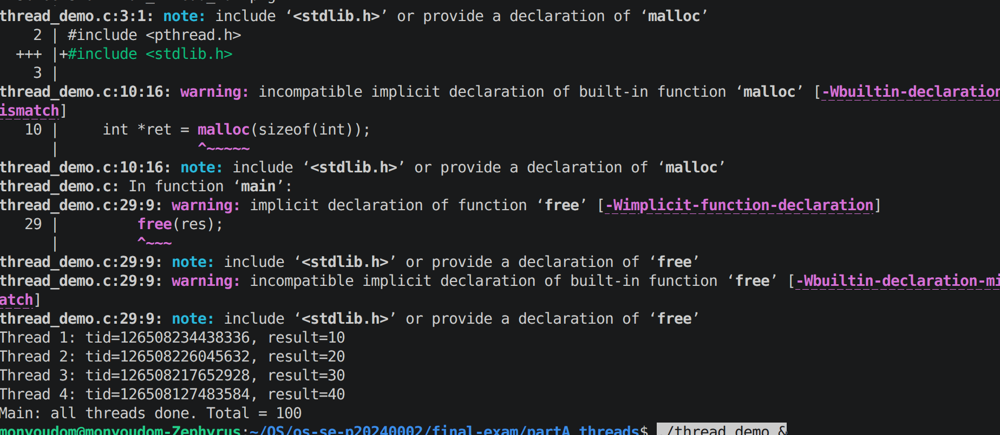
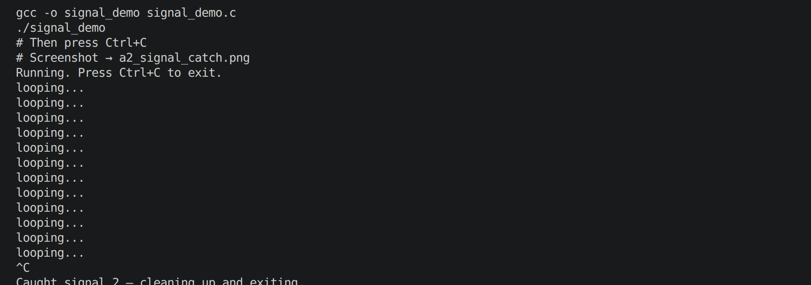
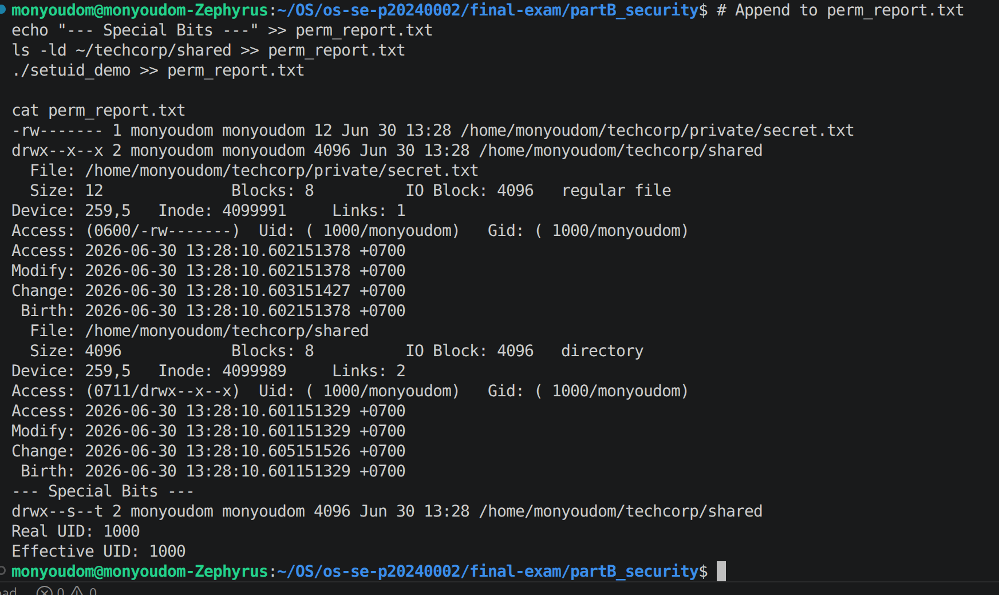
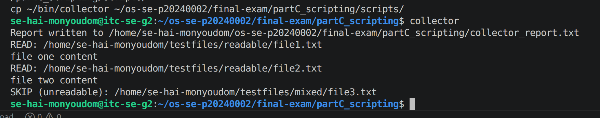
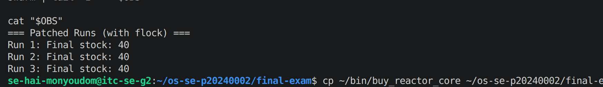
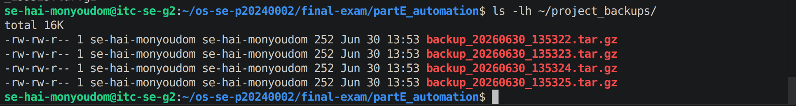

# Final Exam — Se Hai Monyoudom

Student name:  Hai Monyoudom
Student ID: p20240002
Server username: se-hai-monyoudom
Exam scenario value (COMPANY / PRODUCT): TechCorp / Reactor Core
Date & start time: 2026-06-30 / 13:00
AI assistant used (name/none): Claude

> Exact commands per part are in `commands.md`. Live-curveball answers are in `live_mods.md`.

---

## Part A — Threads, Kernel Mapping & Signals

**Screenshots**

**Written (one short answer)**

- **Why does a worker thread's joined result reach the main thread, but a forked child's value would not?**
  A thread shares the same process address space, so a value stored via a pointer and returned through pthread_join is directly readable by the main thread from shared memory. A forked child gets a separate copy of memory (copy-on-write), so any changes the child makes are invisible to the parent — they live in different address spaces.

**Anything not completed:** none

---

## Part B — Files, Permissions & Special Bits

**Screenshot**

**Written (one short answer)**

- **Translate your private file's final octal mode into the 9-char symbolic string:**
  octal 600 → rw-------
  Owner: read+write (rw), Group: none (---), Others: none (---)

**Anything not completed:** none

---

## Part C — Bash Scripting, PATH & Safe File Scanning

**Screenshot**

**Written (one short answer)**

- **Why did greeter fail to run by name before you added your bin directory to PATH?**
  The shell only searches directories listed in $PATH when resolving bare command names. Before adding ~/bin to PATH, the shell searched only default directories like /usr/bin and /bin, where greeter did not exist. Adding ~/bin to PATH told the shell to also look there, allowing greeter to be found and run by name.

**Anything not completed:** none

---

## Part D — Concurrency, a Race Condition & File Locking

**Screenshot**

**Written (one short answer)**

- **Why did the unpatched swarm sometimes leave more stock than the correct final value (with 100 stock and 60 concurrent buyers)?**
  Without locking, multiple buyer processes read the same stale stock value simultaneously before any of them writes back. For example, Process A reads 100, Process B also reads 100, both decrement to 99 and write 99 — one purchase is silently lost. This means fewer decrements actually applied, leaving the stock higher than the correct value of 40.

**Anything not completed:** none

---

## Part E — Backups, Archiving & cron Automation

**Screenshot**

**Written (one short answer)**

- **Archiving vs compression — which one actually shrank the bytes, and why?**
  Compression (gzip via the -z flag in tar) actually shrank the bytes. tar alone simply bundles multiple files into one archive without reducing size. gzip uses the deflate algorithm to find and eliminate repeated patterns in the data, making the total file smaller. Without -z, a tar archive would be roughly the same size as the original files combined.

**Anything not completed:** none

