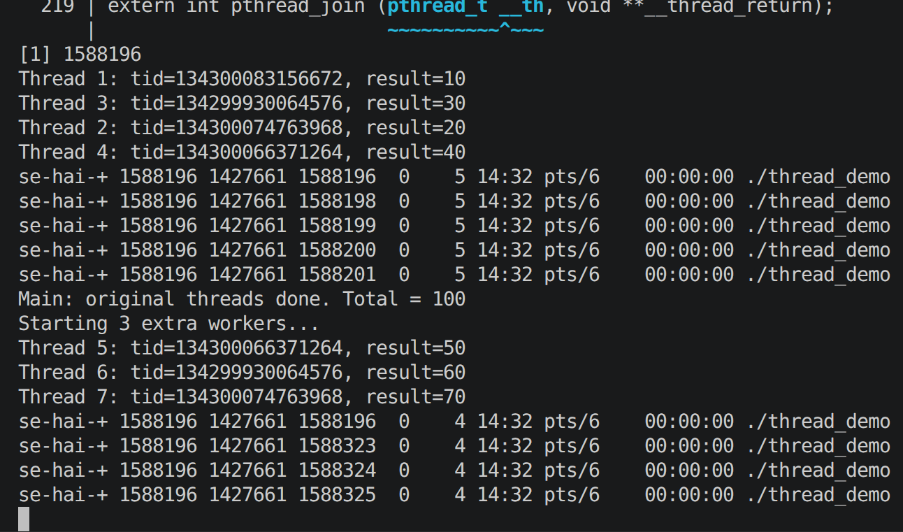
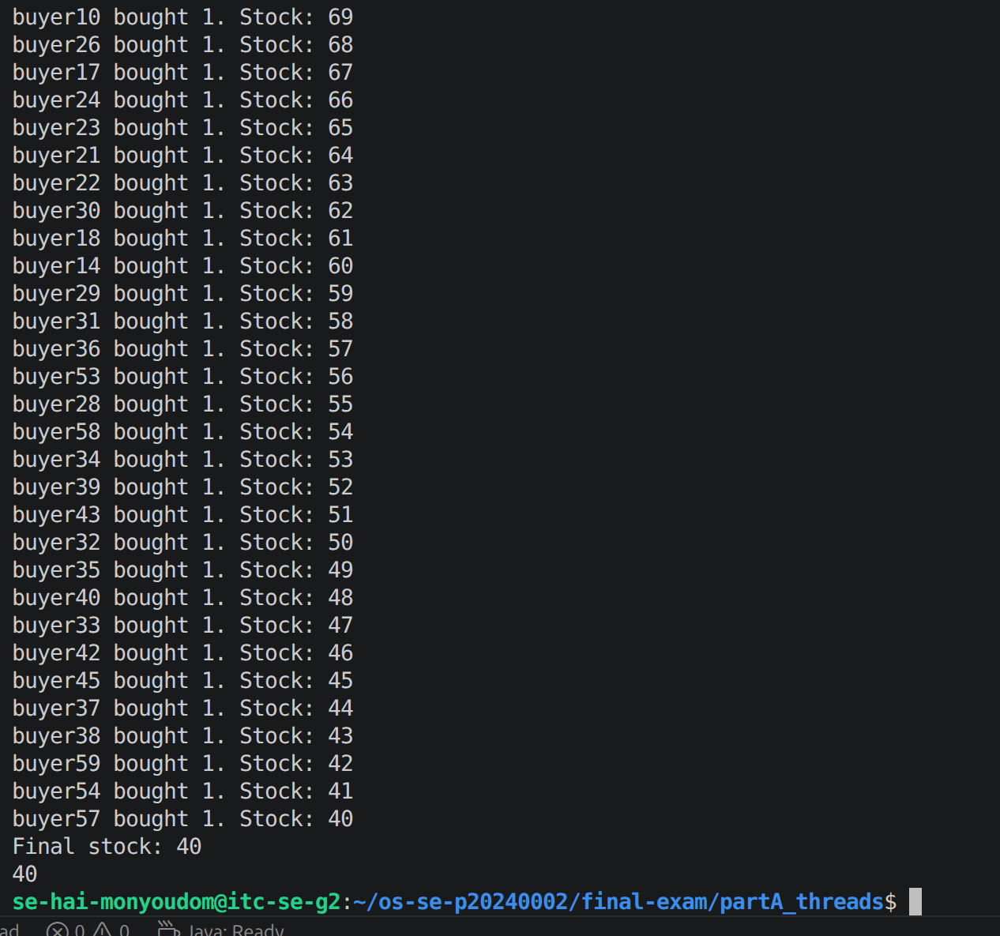
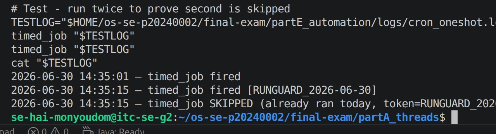

# live_mods.md — Live Modification (curveball) answers

## Curveball A — extra worker(s) that start after the others join

- **Issued value:** 3 extra workers
- **Announced instruction:** Edit thread_demo.c to spawn 3 extra workers that start only after the originals have joined; show the new LWPs appear in the mapping then disappear.
- **Live value(s) I acted on:** base PID = 1588196; new LWP ids that appeared = 1588323, 1588324; original LWPs disappeared after join
- **Commands:**

```bash
cd ~/os-se-p20240002/final-exam/partA_threads
# Edited thread_demo.c to add EXTRA_THREADS=3 block after original join loop
gcc -o thread_demo thread_demo.c -lpthread
./thread_demo &
sleep 3
ps -eLf | grep thread_demo | grep -v grep > thread_map.txt
cat thread_map.txt
```

- **Screenshot:**


---

## Curveball D — per-buyer purchase cap

- **Issued value:** cap = 7
- **Announced instruction:** Add a per-buyer purchase cap to buy_reactor_core — reject any single order above 7; re-run swarm and show the locked result respects the cap and stays consistent.
- **Live value(s) I acted on:** stock before = 100; orders above 7 rejected; final stock = 40
- **Commands:**

```bash
# Added CAP=7 to buy_reactor_core, reject if qty > CAP
echo 100 > ~/stock.txt
swarm
# Final stock: 40
buy_reactor_core testbuyer 8
# rejected — exceeds per-buyer cap of 7
cat ~/stock.txt
```

- **Screenshot:**


---

## Curveball E — idempotent timed_job

- **Issued value:** token = RUNGUARD
- **Announced instruction:** Make timed_job idempotent using marker token RUNGUARD — it must refuse to run if the token for today is already in its log; trigger it twice and prove the 2nd was skipped.
- **Live value(s) I acted on:** today's marker = RUNGUARD_2026-06-30; 1st trigger = ran, 2nd trigger = skipped
- **Commands:**

```bash
# Rewrote timed_job to check for RUNGUARD_<date> before running
chmod +x ~/bin/timed_job
cp ~/bin/timed_job ~/os-se-p20240002/final-exam/partE_automation/scripts/timed_job
TESTLOG="$HOME/os-se-p20240002/final-exam/partE_automation/logs/cron_oneshot.log"
timed_job "$TESTLOG"
timed_job "$TESTLOG"
cat "$TESTLOG"
```

- **Screenshot:**

