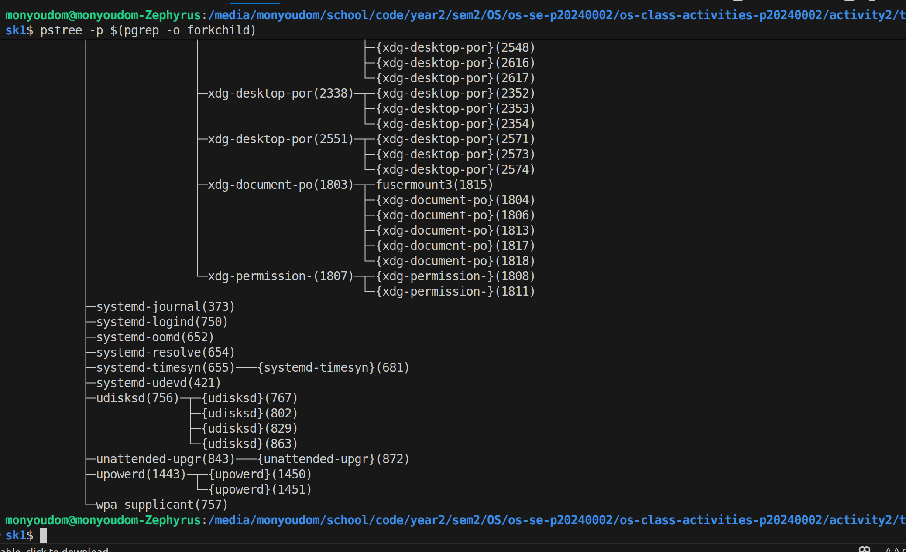
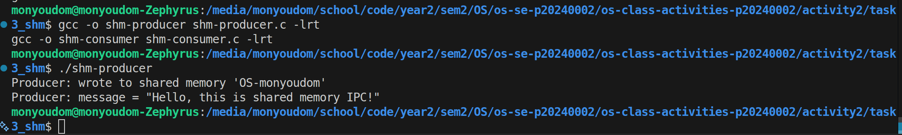
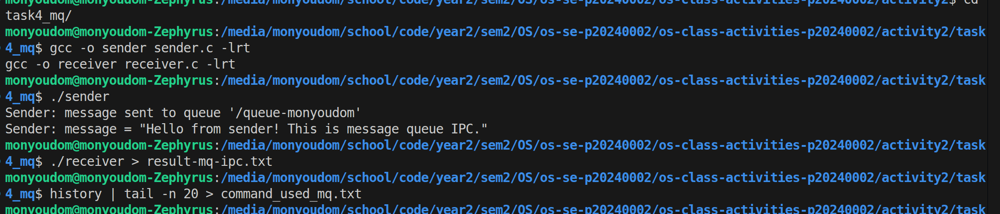

# Class Activity 2 — Processes & Inter-Process Communication

- **Student Name:** [Your Name Here]
- **Student ID:** [Your Student ID Here]
- **Date:** [Date of Submission]

---

## Task 1: Process Creation on Linux (fork + exec)

### Compilation & Execution

Screenshot of compiling and running `forkchild.c`:


### Process Tree

Screenshot of the parent-child process tree (using `ps --forest`, `pstree`, or `htop` tree view):



### Output

```
[Paste the content of result_forkchild.txt here]
```

### Questions

1. **What does `fork()` return to the parent? What does it return to the child?**

   > Parent gets child PID (a number > 0) ,Child gets 0

2. **What happens if you remove the `waitpid()` call? Why might the output look different?**

   > Parent won’t wait → both run at same time .Output becomes mixed or out of order Also child can become zombie process

3. **What does `execlp()` do? Why don't we see "execlp failed" when it succeeds?**

   >It replaces the current program with a new program,We don’t see "execlp failed" because if it works → it never comes back

4. **Draw the process tree for your program (parent → child). Include PIDs from your output.**

   > Parent (PID 1000) = >Child (PID 1001)

5. **Which command did you use to view the process tree (`ps --forest`, `pstree`, or `htop`)? What information does each column show?**

   > I used: pstree (or you can say ps --forest) ,PID = process ID ,PPID = parent process ID ,CMD = program name

---

## Task 2: Process Creation on Windows

### Compilation & Execution

Screenshot of compiling and running `winprocess.c`:


### Task Manager Screenshots

Screenshot showing process tree in the **Processes** tab (mspaint nested under your program):


Screenshot showing PID and Parent PID in the **Details** tab:


### Questions

1. **What is the key difference between how Linux creates a process (`fork` + `exec`) and how Windows does it (`CreateProcess`)?**

   > Linux: fork() then exec() (2 steps) ,Windows: CreateProcess() (1 step do everything)

2. **What does `WaitForSingleObject()` do? What is its Linux equivalent?**

   > It waits for a process to finish ,Linux equivalent = wait() or waitpid()

3. **Why do we need to call `CloseHandle()` at the end? What happens if we don't?**

   > It releases memory/resources ,If not → memory leak (waste resources)

4. **In Task Manager, what was the PID of your parent program and the PID of mspaint? Do they match your program's output?**

   > Parent PID and mspaint PID should match with program output
(just say yes if they match)

5. **Compare the Processes tab (tree view) and the Details tab (PID/PPID columns). Which view makes it easier to understand the parent-child relationship? Why?**

   > Processes tab (tree) is easier Because you can see parent-child visually

---

## Task 3: Shared Memory IPC

### Compilation & Execution

Screenshot of compiling and running `shm-producer` and `shm-consumer`:



### Output

```
Consumer: reading from shared memory 'OS-monyoudom'
Consumer: message = "Hello, this is shared memory IPC!"
Consumer: shared memory unlinked.
```

### Questions

1. **What does `shm_open()` do? How is it different from `open()`?**

   >shm_open() = create/open shared memory ,open() = open file

2. **What does `mmap()` do? Why is shared memory faster than other IPC methods?**

   > It maps memory so processes can share it Faster because no copying (direct access)

3. **Why must the shared memory name match between producer and consumer?**

   >Both programs must use same name → to connect to same memory

4. **What does `shm_unlink()` do? What would happen if the consumer didn't call it?**

   > It deletes shared memory If not → memory stays (resource leak)
5. **If the consumer runs before the producer, what happens? Try it and describe the error.**

   > No such file or directory Because memory not created yet , haven't compile and run it yet
---

## Task 4: Message Queue IPC

### Compilation & Execution

Screenshot of compiling and running `sender` and `receiver`:



### Output

```
Receiver: message received from queue '/queue-monyoudom'
Receiver: message = "Hello from sender! This is message queue IPC."
Receiver: queue unlinked.

```

### Questions

1. **How is a message queue different from shared memory? When would you use one over the other?**

   > Shared memory = faster, but need sync Message queue = easier, messages are organized

   > Use queue when: simple communication 
   > Use shared memory when: high speed needed

2. **Why does the queue name in `common.h` need to start with `/`?**

   > It’s required format in POSIX Without / → error

3. **What does `mq_unlink()` do? What happens if neither the sender nor receiver calls it?**

   > Deletes the queue If not  queue stays in system

4. **What happens if you run the receiver before the sender?**

   > It will wait OR give error (if queue not created)

5. **Can multiple senders send to the same queue? Can multiple receivers read from the same queue?**

   > Yes ,Many senders can send ,Many receivers can read

---

## Reflection

What did you learn from this activity? What was the most interesting difference between Linux and Windows process creation? Which IPC method do you prefer and why?

> learned how processes are created in Linux and Windows and how they communicate using IPC. The most interesting part is Linux uses fork + exec but Windows uses only one function. I like message queue more because it is easier to understand and safer than shared memory.