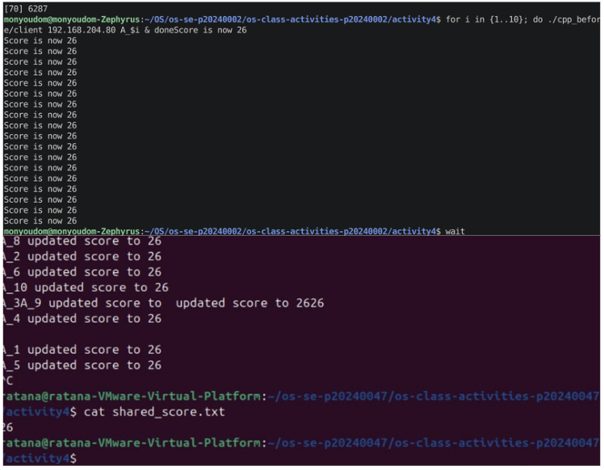
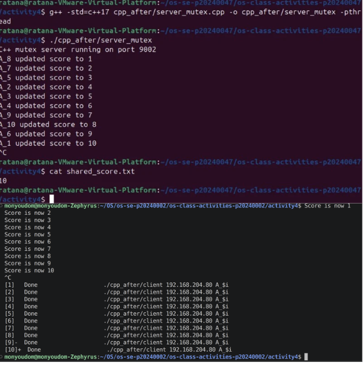
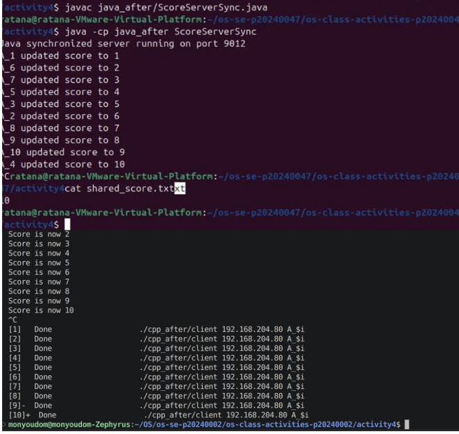
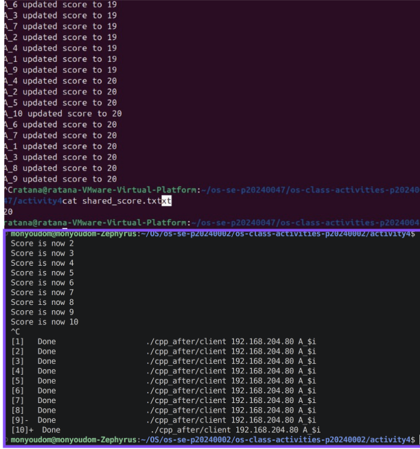

# Class Activity 4 — Shared File API

- **Student Name:** HAI Monyoudom
- **Student ID:** p20240002
- **Partner Name:** Pav Ratana
- **Partner Student ID:** p20240047
- **Server Machine Owner:** Pav Ratana
- **Server IP Address:** 192.168.204.80

---

## Task 1: C++ Before Mutex

- Expected score after 20 total client requests:
- Actual score:
- What happened:

---

## Task 2: C++ After Mutex

- Expected score after 20 total client requests:
- Actual score:
- What changed after adding mutex:

---

## Task 3: Java Before Synchronized

- Expected score after 20 total client requests:
- Actual score:
- What happened:

---

## Task 4: Java After Synchronized

- Expected score after 20 total client requests:
- Actual score:
- What changed after adding synchronized:

---

# Questions

## 1. Why should clients send requests to the server instead of writing the file directly?

Clients should send requests to the server because the server controls access to the shared file. This centralizes file management, improves security, and prevents clients from corrupting the file by writing simultaneously.

---

## 2. Why does the server still have a race condition before mutex or synchronized?

Even though clients communicate through the server, the server may handle multiple requests concurrently using threads. Without synchronization, multiple threads can read and write the shared file at the same time, causing race conditions.

---

## 3. In the C++ fixed version, what does `std::lock_guard<std::mutex>` protect?

`std::lock_guard<std::mutex>` protects the critical section of code where the shared file is accessed or modified. It ensures that only one thread can execute that section at a time.

---

## 4. In the Java fixed version, what does `synchronized` protect?

The `synchronized` keyword protects the critical section or synchronized method that accesses the shared file or shared variable. It prevents multiple threads from executing that code simultaneously.

---

## 5. Why is the final score expected to be 20 when Student A sends 10 requests and Student B sends 10 requests?

Each request increases the score by 1. Since Student A sends 10 requests and Student B sends 10 requests, the total number of increments should be:

10 + 10 = 20

Therefore, the final score is expected to be 20.

---

## 6. What could happen if two separate servers update the same file at the same time?

If two servers update the same file simultaneously without coordination, data corruption or lost updates may occur. One server’s changes could overwrite the other server’s changes, leading to inconsistent or incorrect data.

---

# Reflection

This activity showed the importance of synchronization when multiple threads access shared resources. In C++, synchronization was implemented using `std::mutex` and `std::lock_guard`, while Java used the `synchronized` keyword. Both approaches prevent race conditions by allowing only one thread to access the critical section at a time. The activity demonstrated that shared resources such as files must be carefully protected in concurrent systems to ensure data consistency and correctness.