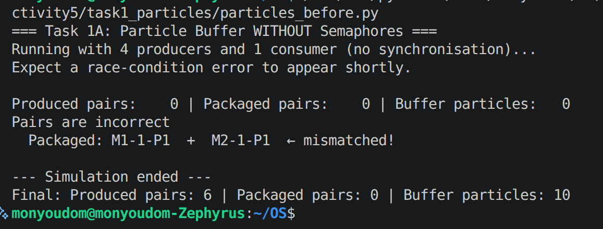
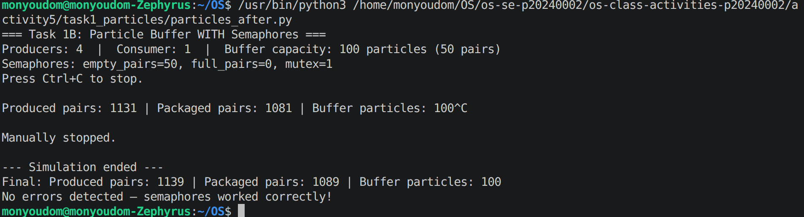
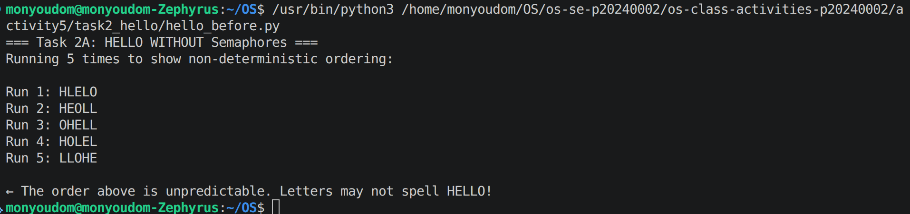
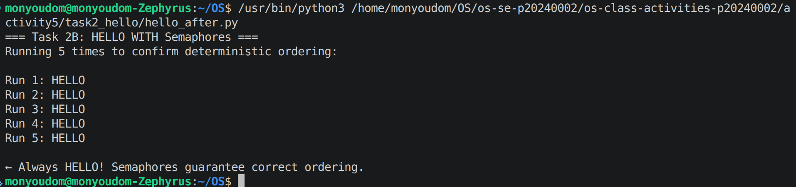

# Class Activity 5 - Semaphores

- **Student Name:** HAI Monyoudom
- **Student ID:** p20240002
- **Programming Language Used:** Python 

---

## Task 1A: Particle Pair Buffer Before Semaphores

- What error or incorrect behavior appeared:
- Why did this happen without semaphore protection:

---

## Task 1B: Particle Pair Buffer After Semaphores

- Number of producer machines:
- Buffer capacity:
- Semaphores used:
- Produced pair count shown in screenshot:
- Packaged pair count shown in screenshot:
- Did any error appear during normal operation?

---

## Task 2A: HELLO Before Semaphores

- Output before semaphore ordering:
- Why this output can be wrong or unpredictable:

---

## Task 2B: HELLO After Semaphores

- Processes or threads used:
- Semaphores used:
- Final output:

---

## Questions

1. A producer must wait because the buffer has a fixed capacity of 50 pairs. Adding without checking would overflow the buffer. The `empty_pairs` semaphore blocks the producer until a free slot exists.

2. The consumer must wait because removing from an empty buffer causes a crash or invalid data. The `full_pairs` semaphore blocks the consumer until at least one complete pair is available.

3. The `mutex` semaphore (initial value 1) protects the critical section. It ensures only one thread at a time can read or write the shared buffer and counters.

4. Each particle is named `M<machine>-<pair_id>-P<n>` (e.g. `M2-17-P1`). After popping two particles, the consumer splits each name by `-` and compares the machine ID and pair ID. If either differs, it prints `Pairs are incorrect` and stops.

5. Without semaphores, all three threads start at the same time and the OS scheduler decides who runs first. Process 3 may print `O` before Process 1 even prints `H`, making the output non-deterministic.

6. `start_he` (initial value 1) lets Process 1 run immediately while Process 2 and 3 are blocked on `after_e` and `after_ll` (both start at 0). Only after Process 1 finishes `HE` and signals `after_e` can the rest proceed.

7. **Task 1:** Deadlock would occur if a thread acquired `mutex` and then tried to acquire `empty_pairs` or `full_pairs` while holding it — creating a circular wait. The fix is to always acquire the counting semaphore *before* `mutex`, never after.  
**Task 2:** Deadlock would occur if the semaphore chain had a cycle (e.g. Process 1 waiting on a semaphore that only Process 3 can signal, while Process 3 waits on Process 1). The linear chain P1 → P2 → P3 has no cycle, so no deadlock is possible.

---

## Reflection

These simulations showed two distinct uses for semaphores. In Task 1, counting semaphores (`empty_pairs`, `full_pairs`) acted as resource guards — preventing buffer overflow and underflow — while `mutex` made buffer access atomic. Without them, the tiny gap between appending P1 and P2 was enough for another thread to corrupt a pair. In Task 2, semaphores initialised to 0 acted as gates, turning three concurrent threads into a guaranteed sequential pipeline. The key insight is that a semaphore is not just a lock — it is a general signalling tool that can express both *"how many resources remain"* and *"has this event happened yet"*.