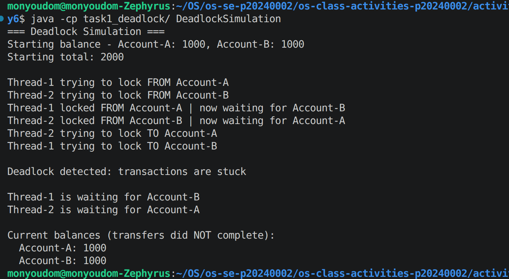
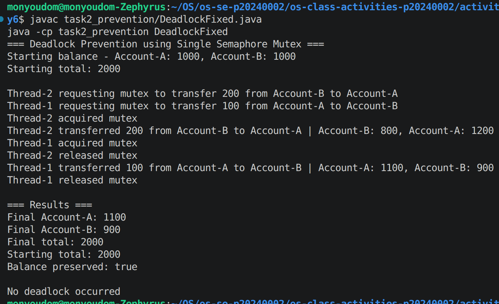

# Class Activity 6 - Deadlock Simulation

- **Student Name:** HAI Monyoudom
- **Student ID:** p20240002
- **Programming Language Used:** Java

---

## Task 1: Deadlock Version

- Shared resources: Account A lock and Account B lock
- Transaction 1: Transfer 100 from Account A to Account B
- Transaction 2: Transfer 200 from Account B to Account A
- Deadlock message shown: "Deadlock detected: transactions are stuck"
- Explanation of why the program got stuck:
Thread 1 locked Account A and waited for Account B, while Thread 2 locked Account B and waited for Account A. Both waited forever.

---

## Task 2: Deadlock Prevention Version

- Prevention strategy used: Single mutex semaphore
- Semaphore mutex initial value: 1
- Starting total: 2000
- Final total: 2000
- Did both transfers complete? Yes
- Why no deadlock occurred:
Only one thread could enter the transfer section at a time, so no circular wait was possible.

---

## Questions

1. What are the two shared resources in your bank transaction simulation?

Account A lock and Account B lock.

2. Which line or section of your Task 1 program creates hold-and-wait?

The section where a thread locks one account and then waits for the second account lock.

3. How does Task 1 create circular wait?

Thread 1 waits for Account B while holding Account A, and Thread 2 waits for Account A while holding Account B.

4. Why does the Task 1 program need a watchdog or timeout?

To detect and report the deadlock instead of hanging forever.

5. How does the single semaphore mutex prevent deadlock in Task 2?

It allows only one transaction to execute the critical section at a time.

6. Which of the four deadlock conditions does your Task 2 solution remove or avoid?

Hold-and-wait, which also prevents circular wait.

7. Why must the final total bank balance remain unchanged after both transfers?

Money is only transferred between accounts, not created or destroyed.

---

## Reflection

This activity taught me how deadlocks occur when multiple threads compete for shared resources. I learned that synchronization techniques such as mutexes, lock ordering, and timeouts can prevent deadlocks and ensure that concurrent systems run safely and correctly.
