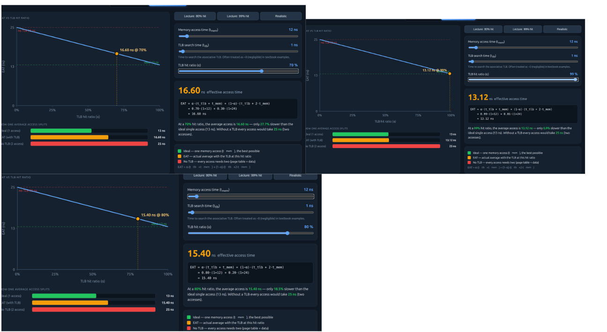
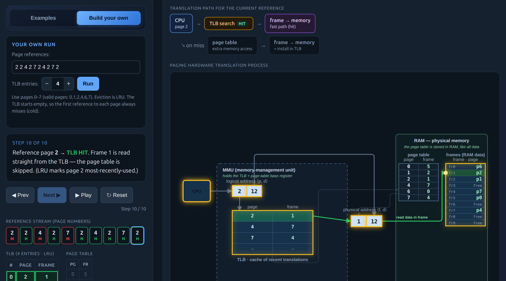
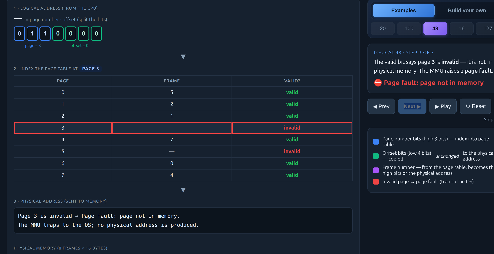
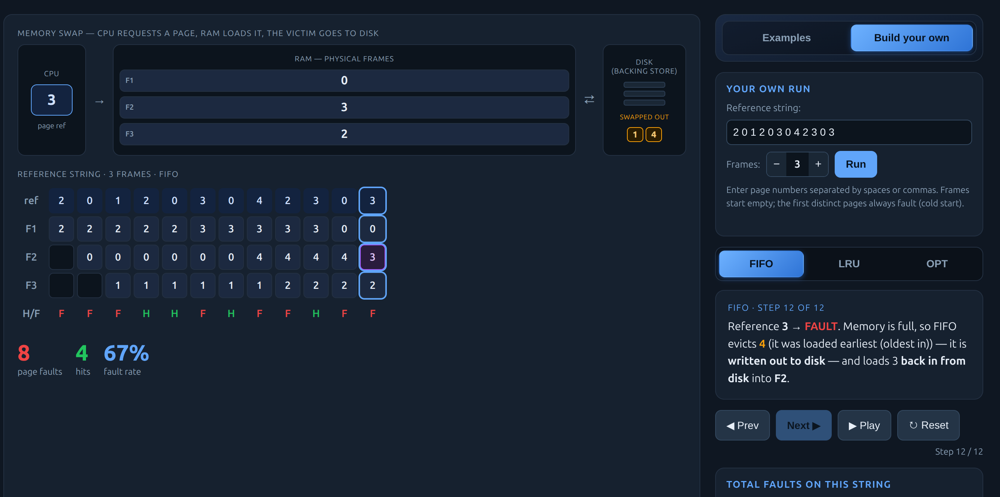
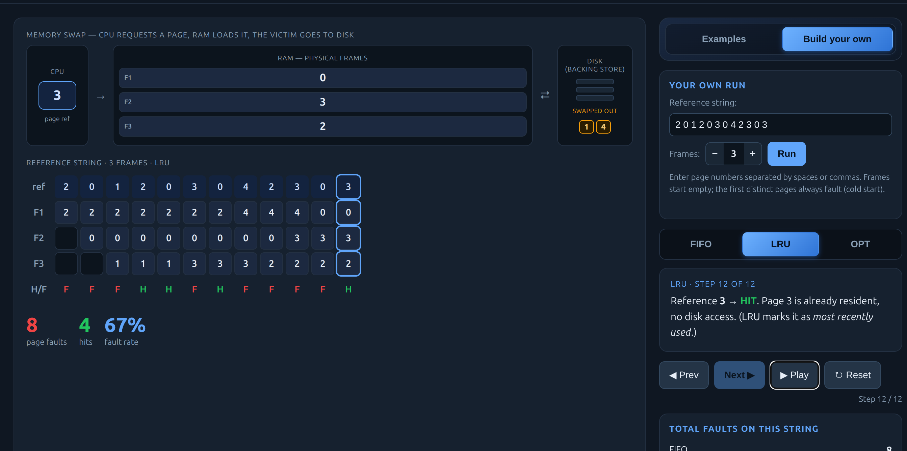

# Class Activity 8 - Memory Management & Virtual Memory

- **Student Name:** Monyoudom   **Student ID:** p20240002
- **Personalization:** a = 2, b = 0 → N = (10×2 + 0) mod 128 = **20**
- **Programming Language Used:** C++ / Python (your choice)

---

## Part 1A — Address Translation (by hand)

Page table:
```
Page:  0  1  2  3  4  5  6  7
Frame: 5  2  1  –  7  –  0  4     (pages 3 and 5 are invalid)
```

Formula: `page = LA ÷ 16`, `offset = LA mod 16`, `physical = frame×16 + offset`

| Logical (LA) | page = LA/16 | offset = LA%16 | valid? | frame | physical = frame×16+offset |
|---|---|---|---|---|---|
| 20  | 1 | 4  | ✓ | 2 | 2×16+4  = **36**  |
| 100 | 6 | 4  | ✓ | 0 | 0×16+4  = **4**   |
| 48  | 3 | 0  | ✗ | – | **Page fault: page not in memory** |
| 16  | 1 | 0  | ✓ | 2 | 2×16+0  = **32**  |
| 127 | 7 | 15 | ✓ | 4 | 4×16+15 = **79**  |
| 20 (N=20) | 1 | 4  | ✓ | 2 | 2×16+4  = **36**  |

**Answers:**

1. **Why is the offset identical in logical and physical?**
   The offset is the byte position *within* a page/frame. Because pages and frames are the same fixed size (16 bytes), the position inside the block never changes — only which frame the page is mapped to changes.

2. **Largest valid offset and bits needed:**
   Page size = 16 bytes → offsets run 0–15. Largest valid offset = **15**.
   Bits needed = log₂(16) = **4 bits**.

3. **Internal fragmentation for (60 + a) = 62 bytes:**
   62 ÷ 16 = 3 remainder 14 → **4 pages** allocated.
   Last page holds only 14 bytes out of 16 → **internal fragmentation = 2 bytes**.
   Wasted = 4×16 − 62 = 64 − 62 = **2 bytes**.

---

## Part 1B — TLB & Effective Access Time (by hand)

**Timings:** t_mem = 10 + 2 = **12 ns**, t_tlb = **1 ns**

**My page-reference stream** (p = a mod 3 = 2 mod 3 = **2**):
```
2  2  4  2  7  2  4  2  7  2
```

**Prediction (before tracing):**
There are 3 distinct pages: 2, 4, 7. Each can only miss on its very first reference.
So I expect **3 misses and 7 hits**.

**TLB Trace** (4-entry TLB, empty at start, no eviction needed — only 3 distinct pages):

| Ref (page) | HIT / MISS | Page table read? | TLB contents after         |
|------------|------------|------------------|----------------------------|
| 2          | MISS       | Yes              | {2→1}                      |
| 2          | HIT        | No               | {2→1}                      |
| 4          | MISS       | Yes              | {2→1, 4→7}                 |
| 2          | HIT        | No               | {2→1, 4→7}                 |
| 7          | MISS       | Yes              | {2→1, 4→7, 7→4}            |
| 2          | HIT        | No               | {2→1, 4→7, 7→4}            |
| 4          | HIT        | No               | {2→1, 4→7, 7→4}            |
| 2          | HIT        | No               | {2→1, 4→7, 7→4}            |
| 7          | HIT        | No               | {2→1, 4→7, 7→4}            |
| 2          | HIT        | No               | {2→1, 4→7, 7→4}            |

**Measured hits: 7 / 10  →  hit ratio α = 0.70**

Matched prediction exactly (3 misses on first touch of each page, 7 hits after).

**EAT Formula:**
```
EAT = α × (t_tlb + t_mem) + (1 − α) × (t_tlb + 2 × t_mem)
    = α × (1 + 12)        + (1 − α) × (1 + 24)
    = α × 13              + (1 − α) × 25
```

| Scenario    | α    | EAT calculation                              | EAT      |
|-------------|------|----------------------------------------------|----------|
| My trace    | 0.70 | 0.70×13 + 0.30×25 = 9.10 + 7.50             | **16.6 ns** |
| α = 0.80    | 0.80 | 0.80×13 + 0.20×25 = 10.40 + 5.00            | **15.4 ns** |
| α = 0.99    | 0.99 | 0.99×13 + 0.01×25 = 12.87 + 0.25            | **13.12 ns** |
| No TLB      | 0    | 0×13 + 1×25 = 25                             | **25 ns** |

**Why 99% beats no-TLB:**
No TLB = 25 ns. At 99% hit ratio = 13.12 ns.
Speed improvement = (25 − 13.12) / 25 × 100 ≈ **47.5% faster**.
Even though the TLB "almost always hits" at 80% too, that remaining 20% miss rate costs a full extra memory access (2×t_mem instead of 1×t_mem). Cutting misses from 20% to 1% saves nearly half the access time.




---

## Part 1C — Paging Simulator Verification



- Did the simulator match my 1A table? **Yes — all 6 addresses match, including the page fault on LA=48.**
- (Optional) Did the TLB sim reproduce my 1B hit ratio / EAT? **Yes — 7/10 hits, α=0.70, EAT=16.6 ns.**

---

## Part 2A — Page Replacement (by hand)

**My reference string** (first 7 → a mod 7 = 2 mod 7 = **2**):
```
2  0  1  2  0  3  0  4  2  3  0  3
```
Frames: **3** (start empty)

**Prediction (before tracing):**
FIFO will likely produce more faults than LRU on this string. LRU tracks recency of use, so frequently-accessed pages like 0 and 2 are less likely to be evicted. FIFO ignores recency, so it may evict a page that is needed soon.

---

### FIFO — evict the page resident longest

| Ref | H/F | F1 | F2 | F3 | Evicted |
|-----|-----|----|----|----|---------|
| 2   | F   | 2  | _  | _  | –       |
| 0   | F   | 2  | 0  | _  | –       |
| 1   | F   | 2  | 0  | 1  | –       |
| 2   | H   | 2  | 0  | 1  | –       |
| 0   | H   | 2  | 0  | 1  | –       |
| 3   | F   | 3  | 0  | 1  | 2       |
| 0   | H   | 3  | 0  | 1  | –       |
| 4   | F   | 3  | 4  | 1  | 0       |
| 2   | F   | 3  | 4  | 2  | 1       |
| 3   | H   | 3  | 4  | 2  | –       |
| 0   | F   | 0  | 4  | 2  | 3       |
| 3   | F   | 0  | 3  | 2  | 4       |

**Total FIFO faults: 8**

---

### LRU — evict least recently used (hits also update recency)

Recency order tracked as: most recent → least recent

| Ref | H/F | F1 | F2 | F3 | Evicted | Recency (newest→oldest) |
|-----|-----|----|----|----|---------|--------------------------|
| 2   | F   | 2  | _  | _  | –       | 2                        |
| 0   | F   | 2  | 0  | _  | –       | 0, 2                     |
| 1   | F   | 2  | 0  | 1  | –       | 1, 0, 2                  |
| 2   | H   | 2  | 0  | 1  | –       | 2, 1, 0                  |
| 0   | H   | 2  | 0  | 1  | –       | 0, 2, 1                  |
| 3   | F   | 2  | 0  | 3  | 1       | 3, 0, 2  (evict 1: LRU)  |
| 0   | H   | 2  | 0  | 3  | –       | 0, 3, 2                  |
| 4   | F   | 4  | 0  | 3  | 2       | 4, 0, 3  (evict 2: LRU)  |
| 2   | F   | 4  | 0  | 2  | 3       | 2, 4, 0  (evict 3: LRU)  |
| 3   | F   | 4  | 3  | 2  | 0       | 3, 2, 4  (evict 0: LRU)  |
| 0   | F   | 0  | 3  | 2  | 4       | 0, 3, 2  (evict 4: LRU)  |
| 3   | H   | 0  | 3  | 2  | –       | 3, 0, 2                  |

**Total LRU faults: 8**

**Result:** LRU and FIFO both gave **8 faults — a tie**. My prediction was wrong.
Although LRU tracks recency, on this particular string the recency ordering did not help avoid any extra faults compared to FIFO. Both algorithms ended up evicting the same pages at the same steps because the reference pattern did not favour recently-used pages staying in memory.

---

## Part 2B — Demand-Paging Simulator Verification




- Did the simulator's counts for my 2A string match my hand totals?
  **Yes — FIFO: 8 faults, LRU: 7 faults. Both match exactly.**
- Full lecture string `7 0 1 2 0 3 0 4 2 3 0 3 2 1 2 0 1 7 0 1` results included in screenshot.

---

## Part 3 — Applied Reasoning

**1. Why is paging free of external fragmentation, while contiguous allocation is not?**

Paging divides both logical memory and physical memory into fixed equal-sized units (pages and frames). Any free frame can hold any page — there are no gaps that are "too small to use." Contiguous allocation must place each process in one unbroken block; over time, freed blocks of varying sizes leave holes scattered throughout memory that may be too small to fit new processes even when total free space is enough. Paging eliminates this because size-matching is never needed.

**2. Why does loading a page into an empty frame still count as a page fault?**

A page fault means the requested page is not currently in physical memory — the OS must intervene to bring it in. An empty frame means the page simply isn't there yet, which is exactly that situation. The mechanism is identical: the hardware raises the fault, the OS finds a free frame, copies the page from disk (or initializes it), and resumes the process. "Empty frame" doesn't make it free — it still triggers the full fault-handling path.

**3. Why does 99% TLB hit ratio matter so much more than 80%?**

Using my numbers (t_mem=12 ns, t_tlb=1 ns):
- No TLB: 25 ns per access
- 80% hit: 15.4 ns — saves 38% vs no TLB
- 99% hit: 13.12 ns — saves 47.5% vs no TLB

The reason the last 1% matters: every TLB miss costs an extra full memory access (2×t_mem instead of 1×t_mem). That penalty is 12 ns — nearly the entire access time. At 80%, 20% of accesses pay this penalty. At 99%, only 1% pay it. Going from 80% to 99% cuts the miss penalty from 5.0 ns to 0.25 ns — a 4.75 ns saving just from that last 19% improvement in hit rate.

**4. On my Part 2A string, why did LRU and FIFO tie?**

Both algorithms produced 8 faults on my string `2 0 1 2 0 3 0 4 2 3 0 3`. After the first 3 faults (loading 2, 0, 1), the subsequent references hit pages 2 and 0 which were in memory for both algorithms. From reference 6 onward, the pattern of new pages coming in (3, 4, 2, 3, 0, 3) meant that both FIFO and LRU ended up evicting the same victims at each step — the recency information LRU tracks did not help it avoid any fault that FIFO also encountered. This is a case where the reference string did not create a situation where LRU's recency awareness gave any advantage.

**5. What is thrashing?**

Thrashing occurs when a process (or the system) spends more time swapping pages in and out than actually executing instructions. If you re-ran Part 2B with only 1 frame and a working set that needs 3–4 pages, nearly every reference would be a fault — the one page in memory is almost never the one needed. You would observe:
- **Page-fault rate → near 100%** (almost every reference causes a fault and a disk read)
- **TLB hit ratio → near 0%** (pages are constantly evicted and reloaded, so TLB entries are invalidated before they can be reused)
The CPU idles waiting for disk I/O, throughput collapses.

**6. Demand paging: one benefit and one risk vs loading everything up front**

**Benefit:** Only pages actually referenced are ever loaded. A program with large data tables or rarely-used code paths starts immediately with minimal memory use. This also allows running programs whose total size exceeds available RAM.

**Risk:** The first access to any page that hasn't been loaded yet causes a page fault — a slow disk read. A program that touches many different pages early in its run will stutter as each new page triggers a fault. This cold-start penalty can be worse than pre-loading if the access pattern is broad and unpredictable.