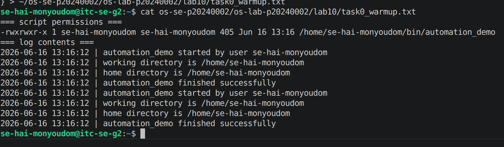
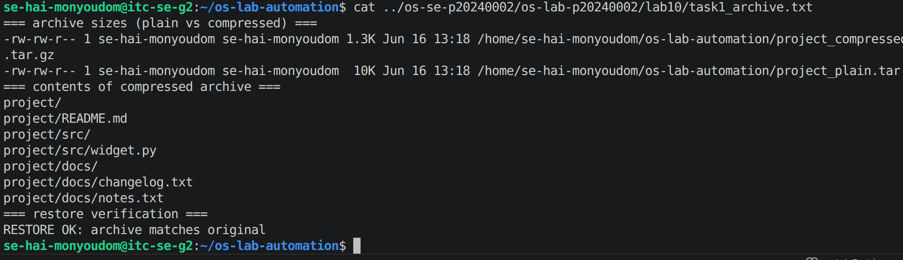
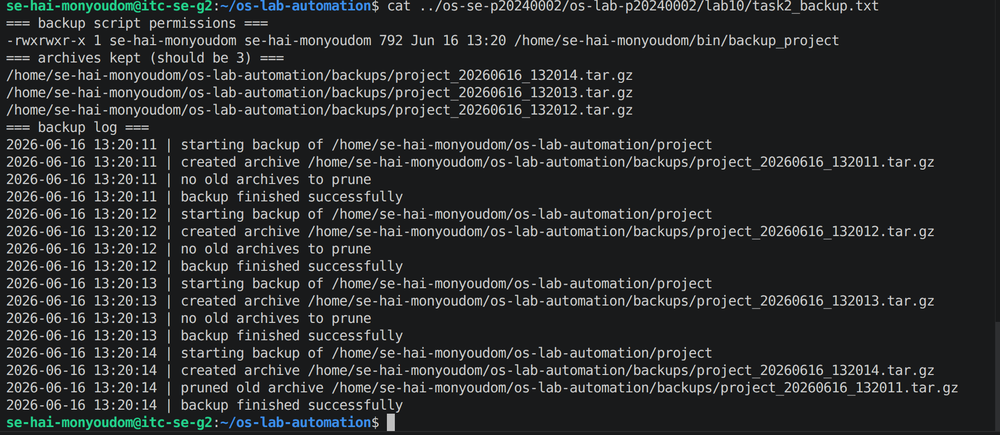
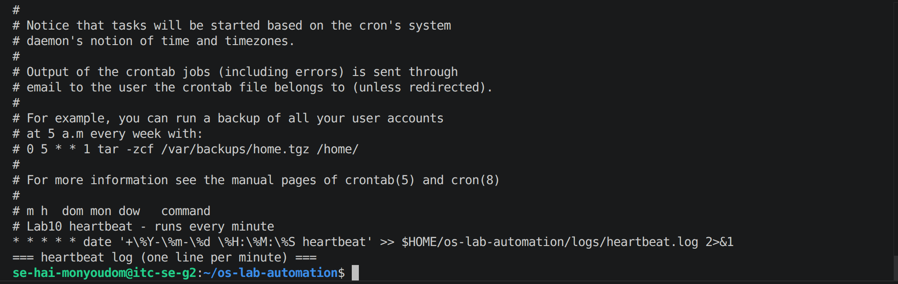
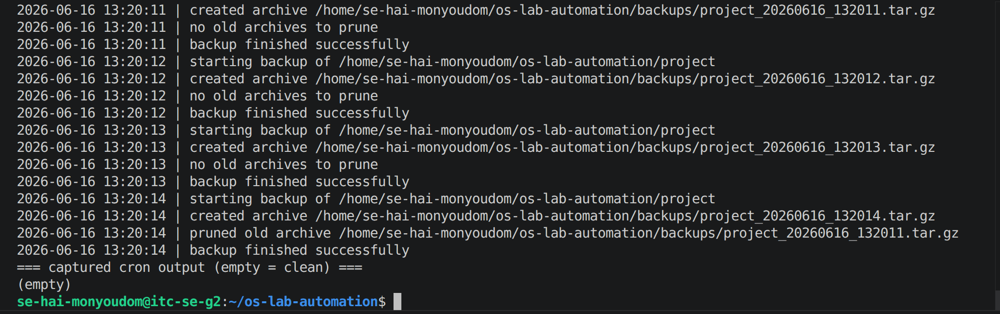
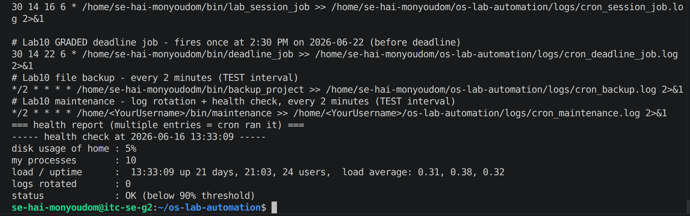
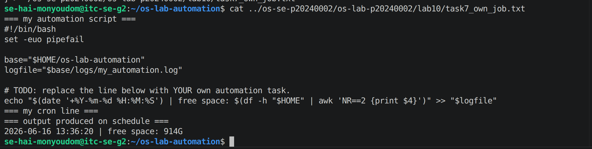
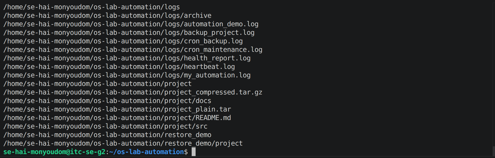

# OS Lab 10 - Backups, Archiving, Scheduling & cron Automation

> Rename this file to `README.md` inside your `lab10/` submission folder, then fill in every section.
> Replace each `` line so your screenshots actually display.
> Delete these quote-block instructions before submitting.

| | |
|---|---|
| **Student Name** | HAI Monyoudom |
| **Student ID** | p20240002 |
| **Linux Username** | se-hai-monyoudom |
| **Date** | 2026-06-16 |

---
## Level 0 - Automation Warm-Up

What I did (1-2 sentences):

`I created and tested a simple automated command to understand basic automation.`

---

## Level 1 - Archiving & Compression

Size of `.tar` vs `.tar.gz` and why:

`The .tar.gz file was smaller because gzip compressed the archive and reduced its size.`

---

## Level 2 - File & Folder Backup Script

How my retention keeps only the 3 newest archives:

`The script sorts backups by date and deletes older ones, keeping only the newest 3 archives.`

---

## Level 3 - Cron Fundamentals

My heartbeat cron line and what each field means:

`Cron uses five fields: minute, hour, day of month, month, and day of week.`

---

## Level 5 - Scheduling the Backup

Why the job needed the absolute path and output redirect:

`The absolute path ensures cron can find the script, and the redirect saves output to a log file.`

---

## Level 6 - Maintenance Automation

What my maintenance job rotates and reports:

`The maintenance job rotates old log files and generates a status report.`

---

## Level 7 - Design Your Own Scheduled Job

**What my script does:** `My script performs a custom automated task on a schedule.`

**Schedule I chose (and why):** `<your cron line + reason>`

**What each of the five cron fields means in my line:** `Minute, hour, day of month, month, and day of week.`

---

## Level 8 - Teardown and Reset

How I removed the practice jobs while keeping the graded deadline job:

`I filtered the crontab to remove only the practice jobs while keeping the graded deadline job.`

---

## Lab Questions

1. **Archiving (`tar`) vs compression (`gzip`) - which shrinks bytes?**
   `gzip shrinks the file size; tar only combines files.`

2. **How much smaller was your `.tar.gz` than your `.tar`, and why?**
   `The .tar.gz was smaller because gzip compressed the archive and removed redundant data.`

3. **Why did your cron jobs need an absolute path instead of `~/bin/...`?**
   `Cron runs with a limited environment and may not expand ~ correctly.`

4. **Why must `%` be escaped as `\%` in a crontab, and what does `>> logfile 2>&1` do?**
   `Cron treats % as a newline. The redirect appends output and errors to the log file.`

5. **How does your `backup_project` retention decide what to delete, and why keep only N backups?**
   `It deletes the oldest backups and keeps only the newest N backups to save disk space.`

6. **Write the cron line that runs `/home/me/bin/deadline_job` once at 2:30 PM on 22 June. Which fields are filled in, which stay `*`?**
   `30 14 22 6 * /home/me/bin/deadline_job`
   
   `Minute=30, Hour=14, Day=22, Month=6, Day-of-week=*.`

7. **In Level 8 teardown, why a filtered `crontab -` pipeline instead of `crontab -r`? What would `crontab -r` have broken?**
   `The pipeline removes selected jobs only. crontab -r would delete all cron jobs, including the graded one.`

8. **Why is a scheduled health check with a threshold alert useful in real software engineering / operations?**
   `It helps detect issues early and alerts administrators before failures occur.`

9. **Describe the job you wrote in Level 7: what it does, the schedule, and the meaning of each of its five cron fields.**
   `My job runs a custom script automatically. The five fields specify minute, hour, day of month, month, and day of week.`