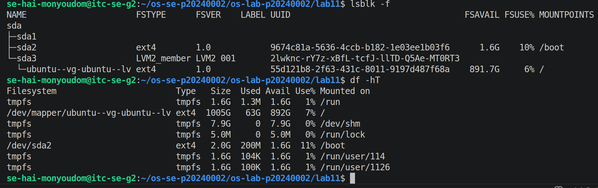
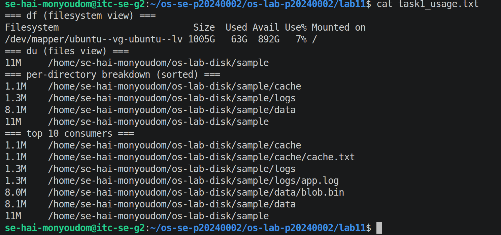
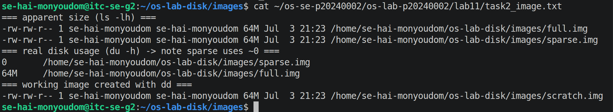
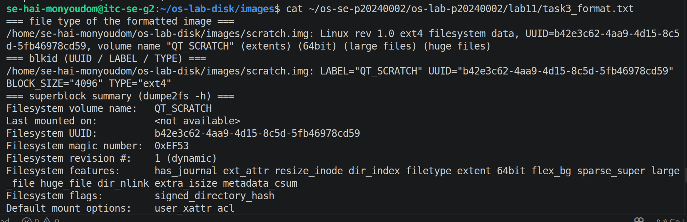
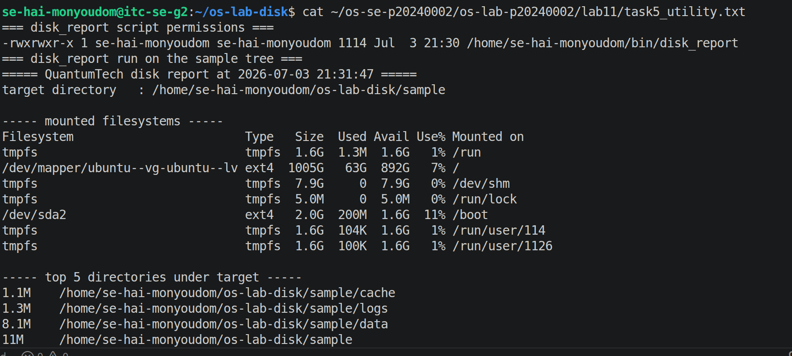
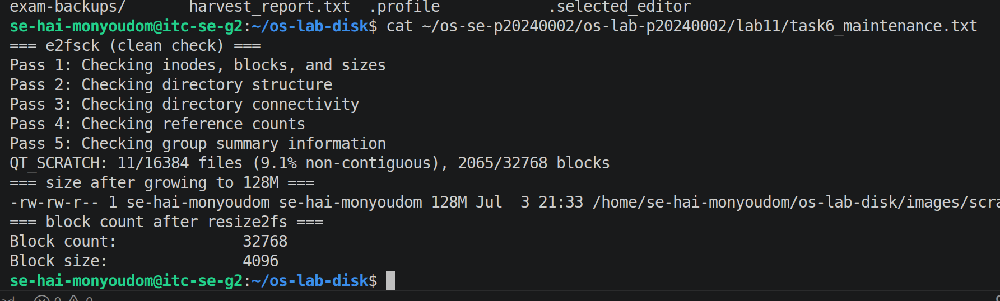
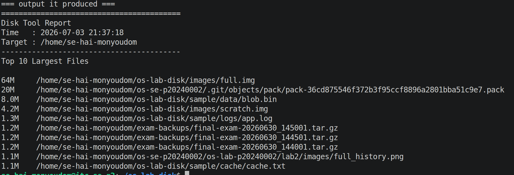
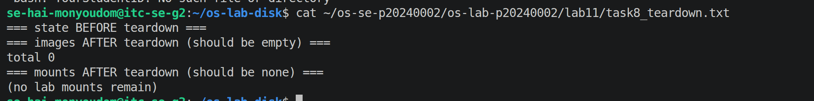

# OS Extra Lab (Bonus) - Linux Disk Management Utilities

| | |
|---|---|
| **Student Name** | Hai Monyoudom |
| **Student ID** | P20240002 |
| **Linux Username** | se-hai-monyoudom |
| **Date** | 2026-07-03 |
| **Mounted with** | `fuse2fs` (no sudo) |

---

## Level 0 - Storage Inventory

What the inventory showed (which filesystem holds my home, how full it is):

The inventory showed that my home directory is stored on the main Linux filesystem. I used `df -hT` to check the filesystem type, total capacity, used space, available space, and usage percentage.

---

## Level 1 - Usage Analysis: `df` vs `du`

The biggest directory under my sample tree and how I found it:

I used `du -sh` and `du -ah` to measure directory sizes and identify the largest directory in the sample tree. Sorting the results helped me quickly locate the directories consuming the most disk space.

---

## Level 2 - Create a Virtual Disk Image

Apparent size (`ls -lh`) vs real usage (`du -h`) for the sparse image, and why they differ:

The sparse image appeared much larger when viewed with `ls -lh` because it reserves virtual space. However, `du -h` showed that it used much less real disk space since empty blocks were not physically allocated.

---

## Level 3 - Format & Inspect a Filesystem

The filesystem type, label, and UUID I created (from `file` / `blkid`):

| Field | Value |
|-------|-------|
| Type | ext4 |
| Label | QT_SCRATCH |
| UUID | *(Your blkid UUID)* |
| Block size | 1024 bytes |

---

## Level 4 - Mount Without Root (FUSE)

How I mounted the image without sudo and the files I wrote onto it:

I mounted the ext4 image using `fuse2fs`, allowing me to access the filesystem without root privileges. After mounting, I created test files inside the mounted directory and verified that they were stored successfully.

---

## Level 5 - Build the Disk Utility Script

What `disk_report` prints and when it raises the threshold alert:

The `disk_report` script prints the current disk usage, available space, filesystem information, and usage percentage. It displays a warning whenever the disk usage exceeds the configured threshold.

---

## Level 6 - Maintenance: Check & Grow

Block count before and after growing the image to 128 MB:

| | Block count |
|---|---|
| Before resize | *(Your value from dumpe2fs)* |
| After resize | *(Your larger value from dumpe2fs)* |

---

## Level 7 - Design Your Own Disk Tool

**What my tool answers:**

My custom tool identifies the ten largest files inside a directory. It helps locate files that consume the most storage so they can be reviewed or cleaned up.

**Commands it uses:**

`find`, `du -h`, `sort -hr`, `head -10`, and `date`.

**How I would schedule it to watch storage over time:**

I would schedule it with cron to run once every day during the evening. This creates a history of large files and helps detect storage growth before the disk becomes full.

---

## Level 8 - Teardown and Reset

How I confirmed nothing was left mounted and removed the images:

I unmounted the FUSE filesystem, verified that no lab mounts remained using `findmnt`, deleted the practice image files, and confirmed that the images directory was empty while keeping the log files as evidence.

---

## Lab Questions

### 1. Difference between `df` and `du`, and one case where they disagree:

`df` reports filesystem usage by reading filesystem metadata, while `du` calculates the size of files and directories by scanning them. They may disagree when deleted files are still open by a running process or when sparse files are present.

---

### 2. `ls -lh` vs `du -h` for the sparse image - what is a sparse file?

`ls -lh` shows the file's logical size, while `du -h` shows the actual disk space allocated. A sparse file contains unallocated empty regions that do not consume physical disk space until data is written.

---

### 3. Why could you run `mkfs.ext4` / `e2fsck` without `sudo` here, but not on a real `/dev/sda1`?

I created and owned the image file, so I had permission to format and check it. A real disk partition such as `/dev/sda1` is a protected system device that requires root privileges to modify.

---

### 4. What does `fuse2fs` give you that a normal `mount` does not, and why is that useful on a shared server?

`fuse2fs` allows users to mount supported filesystem images without root privileges. This is useful on shared servers because users can test and inspect filesystems without requiring administrator access or affecting the host system.

---

### 5. Why does growing a volume need two steps (`truncate` then `resize2fs`)? What if you skip the first?

`truncate` increases the size of the image file, creating additional storage space. `resize2fs` then expands the ext4 filesystem to use that extra space. If `truncate` is skipped, there is no additional storage available for the filesystem to grow into.

---

### 6. What is a filesystem UUID, and why do real systems mount by UUID in `/etc/fstab` instead of by device name?

A UUID is a unique identifier assigned to a filesystem. Systems use UUIDs because device names such as `/dev/sda1` may change after hardware changes or reboots, while UUIDs remain consistent.

---

### 7. What does the use% in `df` mean, and why might writes fail before it reaches 100% (reserved blocks, inodes)?

The use% value indicates the percentage of filesystem space currently in use. Writes may fail before reaching 100% because ext4 reserves blocks for the root user and because a filesystem can run out of inodes even if free storage space still exists.

---

### 8. Describe the tool you wrote in Level 7: the question it answers, the commands it uses, and how you would schedule it.

My tool answers the question, "Which files are using the most storage in this directory?" It uses `find` to locate files, `du -h` to calculate sizes, `sort -hr` to order them from largest to smallest, `head -10` to display the ten largest files, and `date` to timestamp the report. I would schedule it with cron to run every evening so I can monitor storage usage over time.