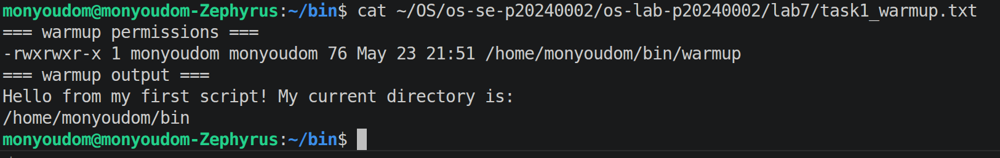
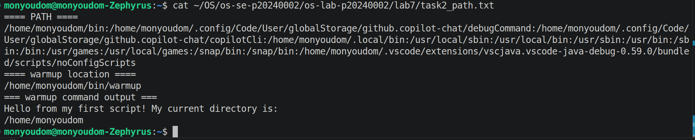
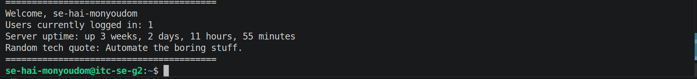
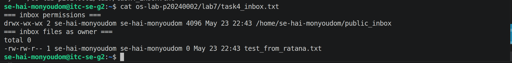
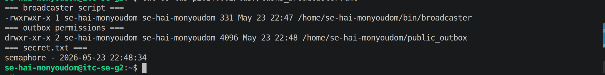
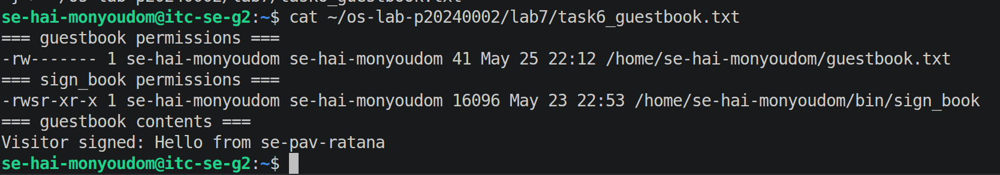
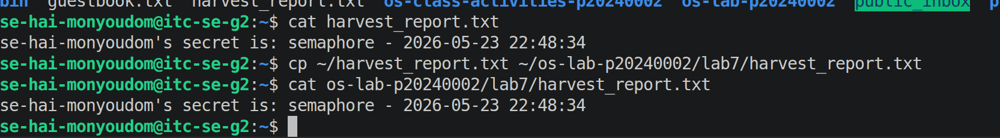
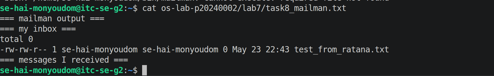

# OS Lab 7 Submission — Bash Scripting, Permissions & Server Automation

- **Student Name:** Hai Monyoudom
- **Student ID:** p20240002

---

## Task Output Files

Make sure all of the following files are present in your `lab7/` folder:

- [ ] `task1_warmup.txt`
- [ ] `task2_path.txt`
- [ ] `task3_doorstep.txt`
- [ ] `task4_inbox.txt`
- [ ] `task5_broadcaster.txt`
- [ ] `task6_guestbook.txt`
- [ ] `harvest_report.txt`
- [ ] `task8_mailman.txt`
- [ ] `sign_book.c`
- [ ] `scripts/warmup`
- [ ] `scripts/broadcaster`
- [ ] `scripts/harvester`
- [ ] `scripts/mailman`
- [ ] `scripts/sign_book_binary`

---

## Screenshots

Insert your screenshots below.

### Screenshot 1 — Task 1: Warm-Up Script
Show `cat task1_warmup.txt` with the executable `warmup` script and successful output.

---

### Screenshot 2 — Task 2: PATH Setup
Show `cat task2_path.txt` with your `PATH`, `which warmup`, and running `warmup` by name.

---

### Screenshot 3 — Task 3: Doorstep Message
Show `cat task3_doorstep.txt` with username, users online, uptime, and random quote.

---

### Screenshot 4 — Task 4: Secure Mailbox
Show `cat task4_inbox.txt` with `public_inbox` permissions and a test file from a classmate.

---

### Screenshot 5 — Task 5: Broadcaster
Show `cat task5_broadcaster.txt` with the broadcaster script evidence and `secret.txt`.

---

### Screenshot 6 — Task 6: VIP Guestbook
Show `cat task6_guestbook.txt` with guestbook permissions, SUID binary permissions, and guestbook contents.

---

### Screenshot 7 — Task 7: Data Harvester
Show `cat harvest_report.txt` containing secrets collected from classmates.

---

### Screenshot 8 — Task 8: Mailman Bot
Show `cat task8_mailman.txt` with mailman output and messages received in your inbox.

---

## Answers to Lab Questions

1. **Why did `warmup` fail before you added execute permission?**
   > The file lacked the execute (`x`) bit, so the OS refused to run it as a program. It needs `chmod +x` to be treated as an executable.

2. **What does adding `~/bin` to `PATH` allow you to do?**
   > It lets you run scripts in `~/bin` by just typing their name from any directory, without needing to specify the full path.

3. **Why does `chmod 733 public_inbox` allow classmates to drop files but not list the inbox?**
   > Write (`w`) lets them create files inside, and execute (`x`) lets them enter the directory, but without read (`r`) they can't run `ls` to see its contents — a drop-box effect.

4. **Why does Linux ignore SUID on shell scripts, and why did we use a compiled C program instead?**
   > Linux ignores SUID on scripts because an attacker could manipulate the environment between kernel and interpreter startup. A compiled binary runs directly, so SUID is applied safely and immediately.

5. **What is the difference between `>` and `>>` in Bash redirection?**
   > `>` overwrites the file each time; `>>` appends to it without erasing existing content.

6. **How did your `harvester` avoid reading files that were missing or not readable?**
   > It used `[ -f "$file" ] && [ -r "$file" ]` checks before reading, silently skipping any file that didn't exist or wasn't accessible.

7. **What permission problems did you or your classmates need to fix during the lab?**
   > Forgetting `chmod +x` on scripts, wrong inbox permissions, guestbook not group-writable, and missing SUID bit on the compiled binary.

---

## Reflection

> This lab showed how scripting, permissions, and automation work together on a shared Linux server. It made abstract concepts like SUID and directory permissions concrete, and highlighted how a single misconfigured permission can affect all users on the system.