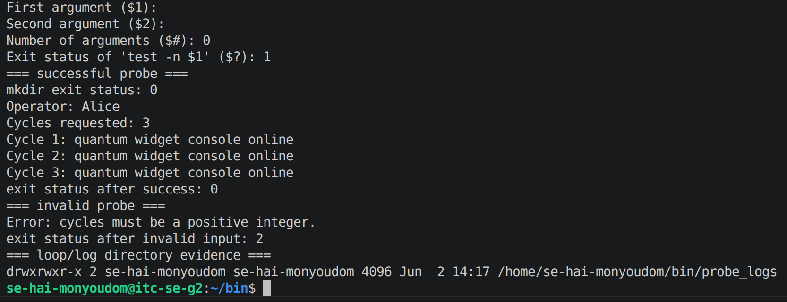
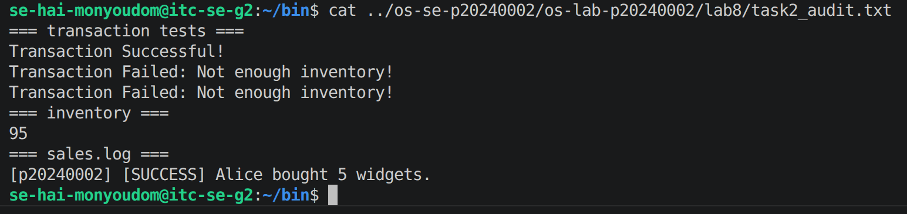
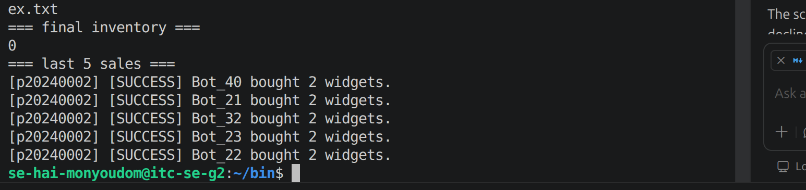
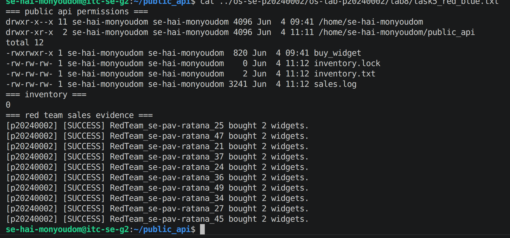
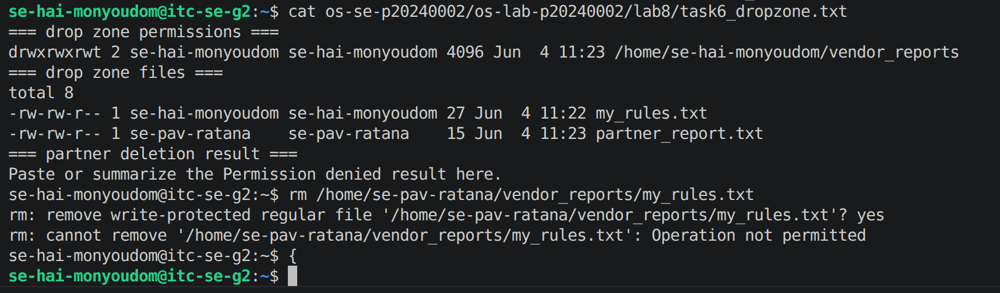
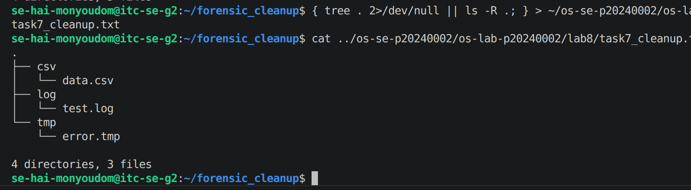

# OS Lab 8 Submission - The Quantum Widget Exploit

- **Student Name:** HAI Monyoudom
- **Student ID:** p20240002
- **Partner Username:** se-pav-ratana

---

## Task Output Files

Make sure all of the following files are present in your `lab8/` folder:

- [ ] `observations.txt`
- [ ] `task0_warmup.txt`
- [ ] `task1_validation.txt`
- [ ] `task2_audit.txt`
- [ ] `task4_mutex.txt`
- [ ] `task5_red_blue.txt`
- [ ] `task6_dropzone.txt`
- [ ] `task7_cleanup.txt`
- [ ] `scripts/arg_viewer`
- [ ] `scripts/quantum_probe`
- [ ] `scripts/buy_widget`
- [ ] `scripts/bot_swarm`
- [ ] `scripts/create_dropzone`
- [ ] `scripts/cleanup`

---

## Screenshots

Insert your screenshots below.

### Screenshot 1 - Level 0: Bash Warm-Up Scripts
Show `arg_viewer` explaining `$0`, `$1`, `$2`, `$#`, and `$?`, then show `quantum_probe` using a condition and a loop.

---

### Screenshot 2 - Level 2: Audit Trails
Show input validation, a successful sale, failed transactions, final inventory, and `sales.log`.

---

### Screenshot 3 - Level 4: Mutex Patch
Show `inventory.txt` exactly `0` after the patched `bot_swarm`, plus the last five lines of `sales.log`.

---

### Screenshot 4 - Level 5: Red Team vs. Blue Team
Show `public_api` permissions, inventory, and sales log evidence that your classmate executed your API.

---

### Screenshot 5 - Level 6: Secure Drop Zone
Show the sticky bit in `ls -ld` output and evidence that your partner could not delete your file.

---

### Screenshot 6 - Level 7: Forensic Cleanup
Show `tree` or `ls -R` output proving `.log`, `.csv`, and `.tmp` files were sorted into folders.

---

## Race Condition Observations

Summarize your five vulnerable `bot_swarm` runs from `observations.txt`:

| Run | Final Inventory | Notes |
|:---:|----------------:|-------|
| 1 |  |  |
| 2 |  |  |
| 3 |  |  |
| 4 |  |  |
| 5 |  |  |

---

## Answers to Lab Questions

# Lab 8 — Lab Questions

**1. What does TOC-TOU mean, and where did it appear in the vulnerable `buy_widget` script?**

TOC-TOU (Time-of-Check to Time-of-Use) is a race condition where a resource changes between when it is checked and when it is used. In `buy_widget`, multiple processes read the same inventory value before any of them writes back, causing overselling.

---

**2. Why did `bot_swarm` sometimes leave inventory values other than `0` before the patch?**

Without a lock, concurrent processes interleaved their reads and writes — two bots could read the same inventory value and both subtract from it, so only one decrement actually took effect. The result varied each run depending on OS scheduling.

---

**3. What part of the script is the critical section, and why must it be protected?**

The critical section is the read → check → subtract → write block on `inventory.txt` plus the append to `sales.log`. It must be protected so only one process can modify shared state at a time, preventing data corruption.

---

**4. How does `flock -x` enforce mutual exclusion between concurrent processes?**

`flock -x` asks the kernel to place an exclusive lock on a file descriptor, so any other process that tries to acquire the same lock is blocked until the first releases it. This guarantees only one process executes the critical section at a time.

---

**5. Which permissions did you use to let a classmate run your API without giving full access to your home directory?**

`chmod o+x $HOME` allows traversal of the home directory, `chmod o+rx buy_widget` allows execution of the script, and `chmod o+rw` on `inventory.txt`, `sales.log`, and `inventory.lock` allows the classmate to interact with shared files — nothing else is exposed.

---

**6. Why does the sticky bit protect files in a shared drop zone?**

The sticky bit restricts deletion so that only the file's owner (or the directory owner) can delete it, even if others have write access to the directory. This prevents users from deleting each other's files in a shared folder.

---

**7. What defensive scripting practice from this lab would you use in a real production script?**

Always validate input before touching any shared resource, and wrap every read-modify-write operation in an `flock` block. These two practices together prevent both bad-data bugs and race condition vulnerabilities.

---

## Reflection

> _What did this lab teach you about the relationship between Bash scripts, OS scheduling, file permissions, and secure concurrent access?_

This lab showed that Bash scripts don't run in isolation — the OS scheduler can interleave multiple instances at any moment, turning a simple read-modify-write into a race condition that corrupts shared data. File permissions control *who* can access resources, but without `flock`, they don't control *when*, so both layers are necessary for secure concurrent access. The core lesson is that any script touching shared state in a multi-process environment must treat the critical section as a first-class concern, not an afterthought.