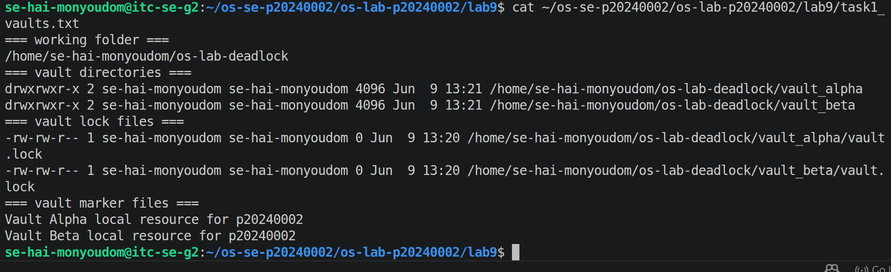
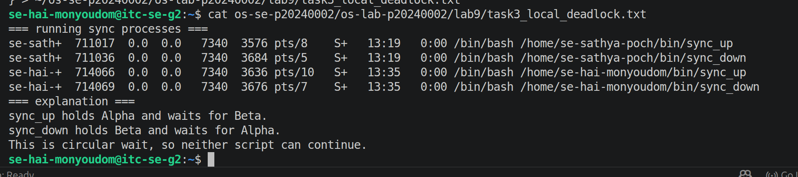
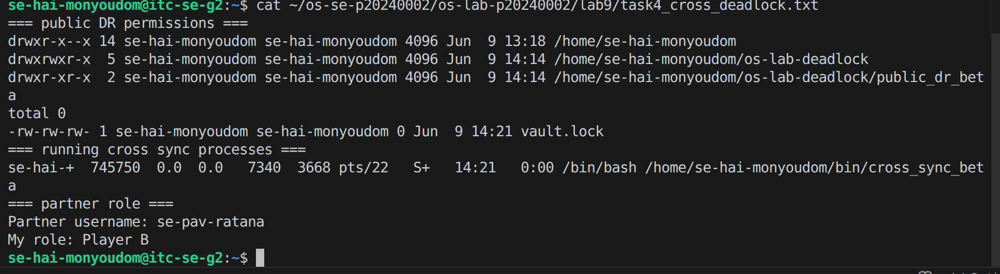
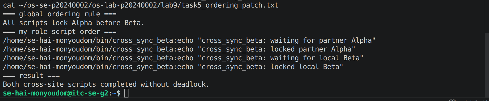
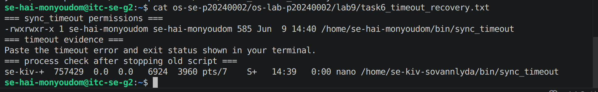
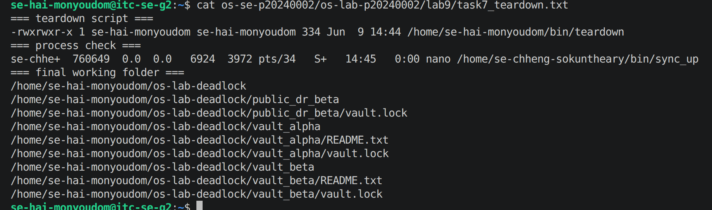

# OS Lab 9 Submission - The Quantum Vault Deadlock

- **Student Name:** [Your Name Here]
- **Student ID:** [Your Student ID Here]
- **Linux Username:** [Your Linux Username Here]
- **Partner Username:** [Partner Username Here]
- **My Role:** [Player A or Player B]

---

## Required Working Files Outside the Repo

Confirm these files and folders existed while you ran the lab:

- [ ] `~/bin/sync_up`
- [ ] `~/bin/sync_down`
- [ ] `~/bin/sync_timeout`
- [ ] `~/bin/teardown`
- [ ] `~/bin/cross_sync_alpha` OR `~/bin/cross_sync_beta`
- [ ] `~/os-lab-deadlock/README.md`
- [ ] `~/os-lab-deadlock/vault_alpha/README.txt`
- [ ] `~/os-lab-deadlock/vault_alpha/vault.lock`
- [ ] `~/os-lab-deadlock/vault_beta/README.txt`
- [ ] `~/os-lab-deadlock/vault_beta/vault.lock`
- [ ] `~/os-lab-deadlock/public_dr_alpha/vault.lock` OR `~/os-lab-deadlock/public_dr_beta/vault.lock`

---

## Task Output Files

Make sure all of the following files are present in your `lab9/` folder:

- [ ] `task1_vaults.txt`
- [ ] `task2_sync_scripts.txt`
- [ ] `task3_local_deadlock.txt`
- [ ] `task4_cross_deadlock.txt`
- [ ] `task5_ordering_patch.txt`
- [ ] `task6_timeout_recovery.txt`
- [ ] `task7_teardown.txt`
- [ ] `scripts/sync_up`
- [ ] `scripts/sync_down`
- [ ] `scripts/sync_timeout`
- [ ] `scripts/teardown`
- [ ] `scripts/cross_sync_alpha` OR `scripts/cross_sync_beta`

---

## Screenshots

Insert your screenshots below.

### Screenshot 1 - Level 1: Vault Workspace Setup
Show `vault_alpha`, `vault_beta`, and their `vault.lock` files.

---

### Screenshot 2 - Level 3: Local Deadlock
Show frozen `sync_up` and `sync_down` terminals or process evidence.

---

### Screenshot 3 - Level 4: Site-to-Site Deadlock
Show partner cross-site scripts frozen in circular wait.

---

### Screenshot 4 - Level 5: Global Resource Ordering Patch
Show ordered locking completing without deadlock.

---

### Screenshot 5 - Level 6: Timeout Recovery
Show the timeout error and nonzero exit status.

---

### Screenshot 6 - Level 7: Cleanup and Reset
Show the process check and final working tree.

---

# Deadlock Observation Table

| Level | Script A Held | Script A Waited For       | Script B Held | Script B Waited For        | Result                  |
| :---: | ------------- | ------------------------- | ------------- | -------------------------- | ----------------------- |
|   3   | Vault Alpha   | Vault Beta                | Vault Beta    | Vault Alpha                | Deadlock                |
|   4   | Vault Alpha   | Vault Beta                | Vault Alpha   | Vault Beta                 | No Deadlock             |
|   5   | Vault Alpha   | Vault Beta (with timeout) | Vault Beta    | Vault Alpha (with timeout) | Recovered after timeout |

# Answers to Lab Questions

1. **What does each `vault.lock` file represent in this lab?**

   > A lock protecting a shared vault resource.

2. **Why does `flock` require every script to lock the same shared file to coordinate correctly?**

   > Because all processes must use the same lock file to synchronize access to the resource.

3. **In the local deadlock, which resource did `sync_up` hold, and which resource did it wait for?**

   > It held Vault Alpha and waited for Vault Beta.

4. **In the local deadlock, which resource did `sync_down` hold, and which resource did it wait for?**

   > It held Vault Beta and waited for Vault Alpha.

5. **Which four deadlock conditions were present in Level 3?**

   > Mutual exclusion, hold and wait, no preemption, and circular wait.

6. **How does the global Alpha-before-Beta ordering rule break circular wait?**

   > All processes request resources in the same order, preventing cycles.

7. **Why is `flock -w` useful for recovery even though it does not prevent every deadlock?**

   > It allows a process to stop waiting after a timeout and recover.

8. **Why should you check for stuck processes before finishing a deadlock lab?**

   > To ensure no deadlocked processes remain running and holding resources.

# Reflection

> This lab taught me how shared resources are protected using locks, how processes synchronize access to resources, how deadlocks occur when resources are acquired in conflicting orders, and how techniques such as lock ordering and timeouts can prevent or recover from deadlocks.
